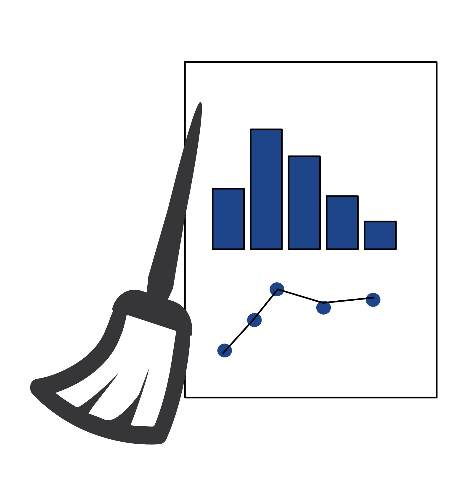
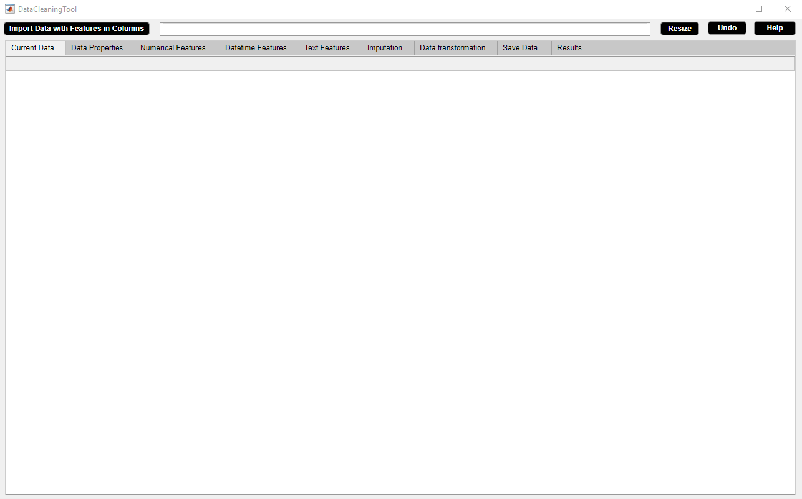
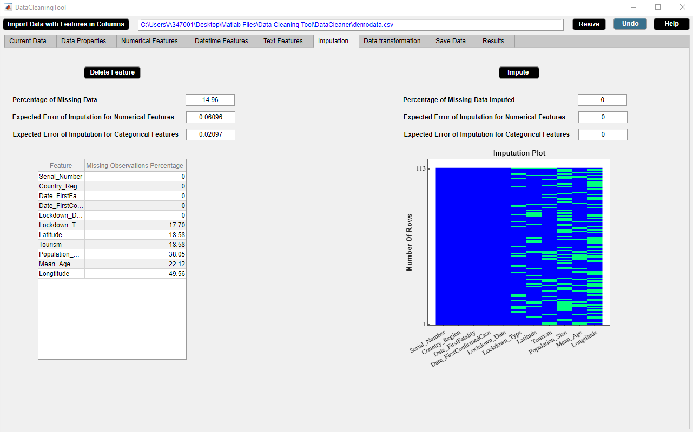
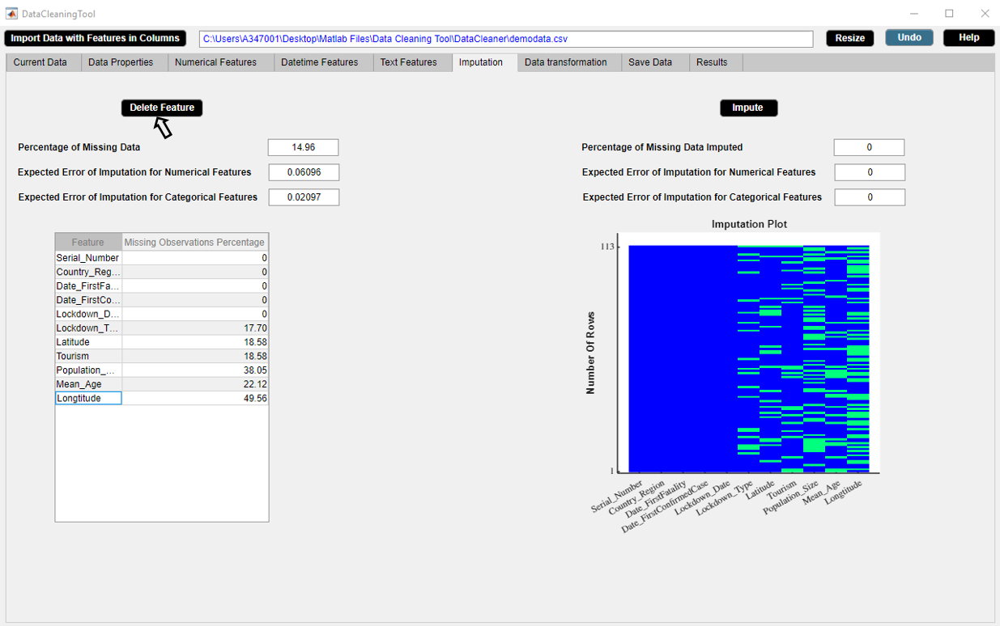
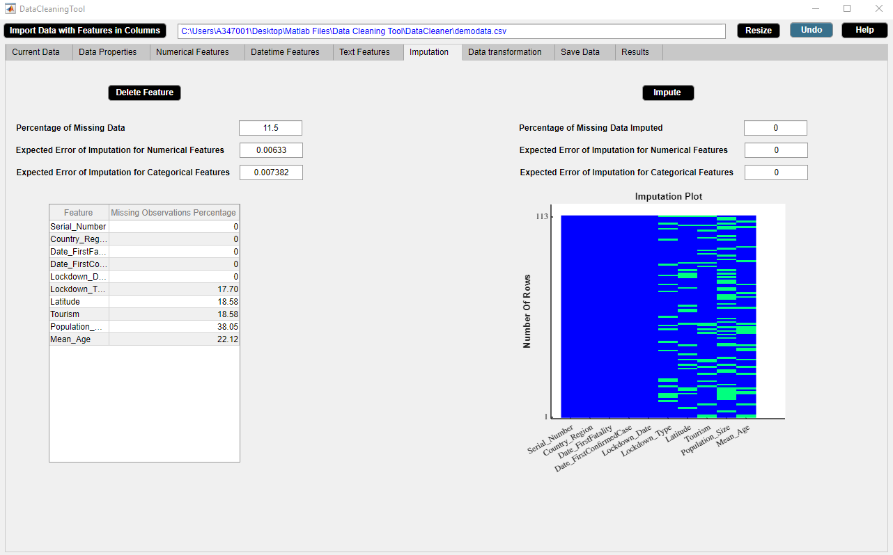
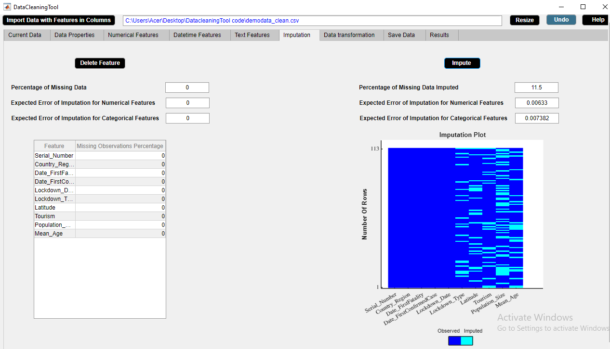

# DataCleaningTool
A cooperative data cleaning standalone application.

## Table of contents ##
- [A statement of need](#A-statement-of-need)
  - [What is DataCleaningTool?](#What-is-DataCleaningTool?)
  - [Why is DataCleaningTool needed?](#Why-is-DataCleaningTool-needed?)
  - [Target audience](#Target-audience)
- [Installation instructions](#Installation-instructions)
  - [Prerequisites](#Prerequisites)
  - [App installation](#App-installation)
- [Example usage](#Example-usage)
  - [Reference documentation](#Reference-documentation)
  - [Simple example](#Simple-example)
- [Community guidelines](#Community-guidelines)
  - [Contribute to the software](#Contribute-to-the-software)
  - [Report issues or problems with the software](#Report-issues-or-problems-with-the-software)
  - [Seek support](#Seek-support)
- [Tests](#Tests)
- [Software license](#Software-license)

## A statement of need ##

### What is DataCleaningTool? ###
DataCleaningTool is a user friendly, free and open source standalone application in order to support the task of data cleaning in a cooperative way. The tool can identify the potential data problems and report results such that the users can make informed decisions to clean data effectively. 

### Why is DataCleaningTool needed? ###
The primary ideas behind developing DataCleaningTool are the following.

1. **Time effectivity** - Data cleaning is a time daunting task to go through manually large number of datasets for identifying the errors. DataCleaningTool is an application for systematically examining data for errors and automatically cleaning them using algorithms.  

2. **Cooperativeness** - DataCleaningTool is not a black box which implies that it does not produce any result which cannot be easily understandable by the user. It motivates and illustrates its suggestions. However, the user is always in control who takes the final action at every stage of the data cleaning process.

3. **Addressing reasonable number of data problems which cause erroneous conclusion and failing algorithms** - DataCleaningTool aims to clean data by resolving inconsistencies, smoothing noisy data, dealing with outliers or imputing missing observations using model based imputation method.

### Target audience ###
DataCleaningTool should be of interest mainly to readers in the area of data science.

## Installation instructions ##

### Prerequisites ###
DataCleaningTool has been developed and tested in MATLAB Version: R2018b and requires the following toolboxes.
1. System Identification Toolbox

2. Statistics and Machine Learning Toolbox

3. Financial Toolbox

4. MATLAB Report Generator

DataCleaningTool Standalone Desktop App has been tested in Windows 10 and requires the [Matlab Compiler Runtime (MCR) R2018b](https://se.mathworks.com/products/compiler/matlab-runtime.html) to be installed.

### Application installation ###
**Standalone Desktop App.** 
Step 1. Download [Standalone Desktop App/for_redistribution.zip](https://github.com/devosmitachatterjee2018/DataCleaningTool/blob/main/Standalone%20Desktop%20App/for_redistribution.zip) and unzip it to a preferred location.

Step 2. Run the executable file "DataCleaningTool.exe" and follow instructions. If not already present, the MATLAB Compiler Runtime (mcr) R2018b will be downloaded from the web and installed automatically.

Step 3. Once installed, the app is added to the Start Menu in Windows.

Step 4. Click the app icon to run the program.

**MATLAB App.** 
Step 1. Download [MATLAB App/DataCleaningTool.mlappinstall](https://github.com/devosmitachatterjee2018/DataCleaningTool/tree/main/MATLAB%20App).

Step 2. Add the app installer file "DataCleaningTool.mlappinstall" to the current working folder in MATLAB.

Step 3. Double-click "DataCleaningTool.mlappinstall". 

Step 4. A dialog box is opened. Click 'Install'. 

Step 5. Once installed, the app is added to the MATLAB Toolstrip. Locate the installed app and select 'Add to favorites'.

Step 6. Click the app icon to run the program.
 
**Functions.**
Step 1. Download all the \*.m files from [DataCleaningTool/Functions](https://github.com/devosmitachatterjee2018/DataCleaningTool/tree/main/Functions). The folder contains a main file and ten dependent files.

Step 2. Add all the \*.m files to the current working folder in MATLAB.

Step 3. Run "DataCleaningTool.m".

## Example usage ##

### Reference documentation ###
To access the complete reference documentation with the exemplary dataset [demodata.csv](https://github.com/devosmitachatterjee2018/DataCleaningTool/blob/main/demodata.csv), refer to [UserManual.pdf](https://github.com/devosmitachatterjee2018/DataCleaningTool/blob/main/UserManual.pdf).

### Simple example ###
DataCleaningTool is a data cleaning application which consists of multiple widgets and buttons. Each widget illustrates its corresponding data cleaning mechanism and each button aims to deal with a specific data problem.

 
A simple example is demonstrated on the Imputation widget using the example dataset [demodata_clean.csv](https://github.com/devosmitachatterjee2018/DataCleaningTool/blob/main/demodata_clean.csv). The Imputation widget displays information about missing data and the expected error of imputation for numerical and categorical features. The properties of the Imputation widget are as follows. 

1. The widgets shows statistics about missing data such as percentage of missing data, expected error of imputation for numerical and categorical features. The performance analysis results of the missForest method is used to predict the expected error of imputation for numerical and categorical features for the specific ratio of data and percentage of missing data. 

2. The widget also presents the missing observations percentage table and the missingness plot. 

3. The Delete Feature button is used to delete a feature from data. This drops a feature which contains a large number of missing values. 

4. The Impute button is used to replace missing observations by estimated ones using missForest algorithm. If datetime observations are missing, a message stating that datetime imputation is not possible appears in red color in the lower side of the Imputation widget. 

5. The information of the missing data in the widget gets updated after each activity.

**Drop feature with large number of missing observations.**

In the example dataset, 'Longitude' has a large number of missing values. We use Delete Feature button to delete 'Longitude' feature.

Step 1. Select a feature from Feature column of missing observations percentage table. Click Delete Feature button.

Step 2. Delete Feature button in use turns grey in color and returns back to its original color once the task is completed. Check that the selected feature is deleted.

**Illustrate and impute missing observations.**

We use Impute button to impute missing values in the example data using missForest method.

Step 1.  Click Impute button.

Step 2. Impute button in use turns grey in color and returns back to its original color once it completes its task. Check that the missing observations are imputed.

## Community guidelines ##

### Contribute to the software ###
To contribute fixes, feature additions or enhancements, a pull request can be created in the [Pull requests](https://github.com/devosmitachatterjee2018/DataCleaningTool/pulls) tab of the project GitHub repository. When contributing to the software, the folowing should be included.
1. Description of the change

2. Check that all tests pass

3. Include new tests to report the change

### Report issues or problems with the software ###
Any feature request or issue can be submitted to the the [Issues](https://github.com/devosmitachatterjee2018/DataCleaningTool/issues) tab of the project GitHub repository. When reporting issues with the software, the folowing should be included.
1. Description of the problem

2. Error message

3. MATLAB version and Operating System

### Seek support ###
If any support needed, the author can be contacted by e-mail <chatterjeedevosmita267@gmail.com>. 

## Tests ##
Step 1. Download [Standalone Desktop App/for_testing.zip](https://github.com/devosmitachatterjee2018/DataCleaningTool/blob/main/Standalone%20Desktop%20App/for_testing.zip) and unzip it to a preferred location.

Step 2. Run "DataCleaningTool.exe" for testing.

## Software license ##
DataCleaningTool is released under the [LICENSE](https://github.com/devosmitachatterjee2018/DataCleaningTool/blob/main/LICENSE) GNU General Public License v3.0.
