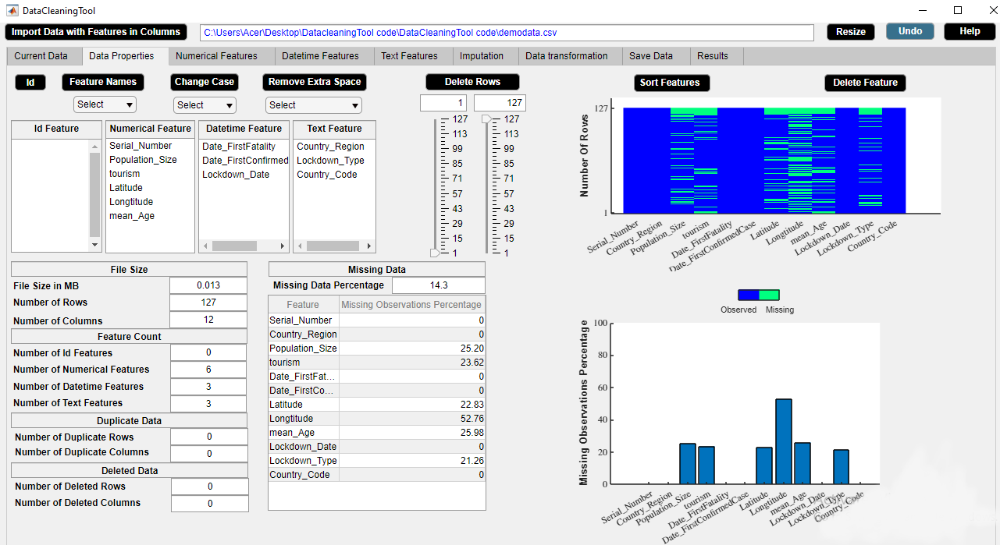

# Summary
Nowadays, organizations rely on data driven decision making. Data driven decision making is a process which involves collecting large amount of data, analyzing patterns and facts from these insights and using them to develop strategies that benefit organizations. Successful analysis depends on accurate and well structured data. Thus, high quality data is of utmost priority to draw good and valid business decisions and strategies. However, real world data is messy and almost never comes in a clean way. Data cleaning is the ultimate way to solve the data problems. But, data cleaning is really a time consuming task. This demands data cleaning tools for systematically examining data for errors and automatically cleaning them using algorithms. These data cleaning tools help organizations save time and increase their efficiency. 

In order to achieve the task of data cleaning, we develop a cooperative, free and open source data cleaning standalone MATLAB application named 'DataCleaningTool'. This application is able to identify the potential data problems and report results such that the users can make informed decisions to clean data effectively.

# Statement of Need

The primary ideas behind developing DataCleaningTool are the following.

1. **Time effectivity** - Data cleaning is a time consuming task to go through manually such large number of datasets for identifying the errors. DataCleaningTool is a tool which can help with the task.

2. **Cooperativeness** - DataCleaningTool is not a black box which implies that it does not produce any result which cannot be easily understandable by the user. It motivates and illustrates its suggestions. However, the user is always in control who takes the final action at every stage of the data cleaning process.

3. **Addressing reasonable number of data problems which cause erroneous conclusion and failing algorithms** - DataCleaningTool aims to clean data by resolving inconsistencies, smoothing noisy data, removing outliers or imputing missing observations using model based imputation method.

# Method
DataCleaningTool provides various assistances to users to clean data quickly and efficiently. DataCleaningTool is shown in figure \autoref{fig:dataproperties}.

## Automated Assistances

1. **Automated Statistical Information of Data** - DataCleaningTool displays input data in tabular format. It also shows data properties.

2. **Automated Data Type Discovery** - DataCleaningTool discovers basic statistical data types such as numerical, text and datetime. Moreover, it shows descriptive statistics of the different data types.

## User Assistances
1. **Removal of Unwanted Data** - DataCleaningTool can identify irrelevant observations which do not fit the specific problem that the user is trying to solve. It can either replace an irrelevant observation with a missing observation or delete any row containing irrelevant observations.

2. **Outlier Detection** - DataCleaningTool can illustrate possible outliers. It can either replace an outlier with a missing observation or delete any row containing outliers.

3. **Missing Data Handling** - DataCleaningTool can illustrate missing observations. It can delete rows or features containing large number of missing observations. It can impute missing observations using missForest method [@Stekhoven:2012]. It shows expected error of imputation for both numerical and categorical features.

4. **Encoding** - DataCleaningTool can encode categorical features into numerical equivalents. Both label encoding and one-hot encoding approaches are implemented in the application.

5. **Data Transformation** - DataCleaningTool can standardize, normalize, logarithm, exponential, squareroot or inverse transform numerical features. It can illustrate transformed numerical features.

6. **Interactive Data Visualization** - DataCleaningTool can explore and manipulate various aspects of graphical representation of data by clicking on a button or moving a slider. It provides different visual methods such as histogram, bar graph, box plot, missingness plot and bar chart.

# Related Research and Software
Similar research projects that are associated with data cleaning include development of the following software packages. 

* datacleaner [@Olson:2016] is a Python library which only works with data in pandas DataFrames.  It does the following tasks: deletes features with missing observations, replaces missing observations with mean for continuous features and median for categorical features, and encodes categorical features into numerical ones.

* dataMaid [@Petersen:2019] is a R package. It summarizes each feature in the data and encounters several data problems such as extra whitespace, missing data and outliers, depending on the datatype of the feature. 

# Figures

# Acknowledgements

The authors wish to thank Klara Jansson, Volvo Group Trucks Technology for the helpful discussions during the development of the application.

# References

